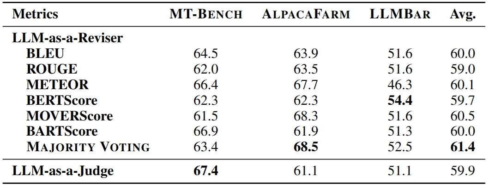

# RevisEval: Improving LLM-as-a-Judge via Response-Adapted References
<!-- Example: Test-Time Scaling Atlas: A Unified Framework for Inference-Time Reasoning in LLMs -->


<div align="center">
  
  <p><b>Figure 1:</b> Illustration of RevisEval.</p>
</div>

**REVISE-AND-EVALUATION (RevisEval)** is a novel text generation evaluation paradigm via the response-adapted reference. RevisEval is driven by the key observation that an ideal reference should maintain the necessary relevance to the response to be evaluated. Specifically, REVISEVAL leverages the text revision capabilities of large language models (LLMs) to adaptively revise the response, then treat the revised text as the reference (response-adapted reference) for the subsequent evaluation.

## 📢 News and Updates

- **[Apr 2025]** 📌 Our paper is revised on [**Arxiv**](https://arxiv.org/abs/2410.05193)!!!
- **[Feb 2025]** 📌 Our paper is accepted by [ICLR 2025 Poster](https://openreview.net/forum?id=1tBvzOYTLF&referrer)!!!
- **[Oct 2024]** 📌 Our initial paper is on [**Arxiv**](https://arxiv.org/abs/2410.05193)!

---

## 📘 Overview

<!-- Add 1-3 key diagrams or tables summarizing your project -->

 

<p align="center"><b>Table 1:</b> Kendall (τ) and Spearman (ρ) correlation results comparing reference-free, reference-based, and RevisEval methods across natural language generation tasks. This table demonstrates that, without human-annotated references, our proposed RevisEval substantially outperforms referencefree and reference-based methods involving both open-source and proprietary LLM-as-a-Judge.</p>

 

<p align="center"><b>Table 2:</b> Accuracy of LLM-as-a-Judge on instruction-following preference tasks. Our proposed RevisEval considerably enhances the performance of both open-source and proprietary LLM-as-a-Judge across various general evaluation tasks. Here, D.R. denotes Direct Response to instruction.</p>

 

<p align="center"><b>Figure 1:</b> Comparative analysis of reference-based metrics performance using references generated by HUMAN/GPT-4 and RevisEval on NLG and instruction following benchmarks. RevisEval greatly enhance traditional ref-based metrics, even achieving them comparable to GPT-4-as-a-Judge.</p>


<div align="center">
  
  <p><b>Table 3:</b> Comparative analysis of weak LLM-as-a-Judge and weak LLM-as-a-Reviser+classic metrics on instruction-following tasks. Under the same finetuning training resources, a weak LLMas-a-Reviser combined with classic metrics can produce better results.</p>
</div>

There are more detailed results in our paper~


---

## 🚀 How to Use

### 📦 Installation

1. Clone the repository and navigate to the project folder:

```bash
git clone https://github.com/Don-Joey/RevisEval.git
cd RevisEval
```

2. Create the environment and install dependencies:
   
```bash
conda create -n revisevavl python=3.10 -y
conda activate revisevavl
pip install --upgrade pip
pip install -r requirements.txt
```

### ⚡ Quick Start

Evaluate **RevisEval** on the RewardBench.

```bash
## Our generated crowd judgments are in ``results/rewardbench_mtbench_PoolModified_gpt-4o.json''
## You should fill your api-key.
run MAIN.ipynb
```

In main.ipynb, we provide the *criticizing selection/outcome removal part*, *crowd-judgment as context in prompt part*, and *evaluating CCE part*.

### 🔍 Whole Pipeline

1. **Generate Crowd-Responses**: At this stage, you can use any LLM of your choice to generate the corresponding crowd responses for the prompts in the benchmark.
    
2. **Generate Crowd-Judgments**: At this stage,

```bash
## if you want to compare crowd response to response B,
python main.py [benchmarkname: e.g.,rewardbench] [judgd prompt, e.g.,mtbench] [crowd judgment model name: e.g.,qwen-2.5-3b-instruct],default [base judge model: e.g.,gpt-4o] False True False

## if you want to compare crowd response to response A,
python main.py [benchmarkname: e.g.,rewardbench] [judgd prompt, e.g.,mtbench] default,[crowd judgment model name: e.g.,qwen-2.5-3b-instruct] [base judge model: e.g.,gpt-4o] False True False
```

## 📌 Coming Soon

- [ ] Support for whole pipeline generation
- [ ] Compare to other test-time scaling for LLM-as-a-Judge/Generative RM.

## 📄 Citation

```bibtex
@inprocedings{zhang2025crowdcomparativereasoningunlocking,
    title={Crowd Comparative Reasoning: Unlocking Comprehensive Evaluations for LLM-as-a-Judge}, 
    author={Qiyuan Zhang and Yufei Wang and Yuxin Jiang and Liangyou Li and Chuhan Wu and Yasheng Wang and Xin Jiang and Lifeng Shang and Ruiming Tang and Fuyuan Lyu and Chen Ma},
    year={2025},
    eprint={2502.12501},
    booktitle={arXiv},
}
···
